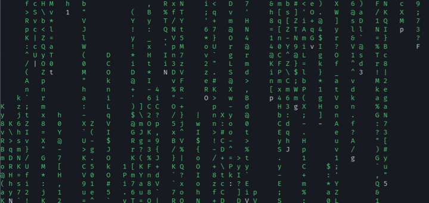

# zmatrix

zmatrix is a (partial) clone of the popular
[cmatrix](https://github.com/abishekvashok/cmatrix) program written purely in
[Zig](https://ziglang.org/). It's currently just a project for me to learn
Zig as a language, but feel free to contribute any ideas/code.

## Capabilities

zmatrix can replicate all core functionality of cmatrix.

This includes the basic premise (characters falling down a terminal) as well
as changing the color of the characters

zmatrix has support for the following flags (some inherited from cmatrix,
others are original):
- a: Asynchronous scroll - columns of characters move at different speeds
- b: Bold - characters can be in bold
- B: All bold - all characters are bold
- C [color]: set the desired character color
- g [color]: set the desired background color.
   - If no option is provided, the background will be the terminal's black
   color
   - This option is provided since zmatrix does not set a background color by
   default, unlike newer builds of cmatrix.
- h: Help - print this help message
- r: rainbow: random colors for each character
   - Note: unlike cmatrix's rainbow mode, the color of a character does not
   change 

## Building zmatrix

zmatrix is a purely Zig project, so the only thing you need to install is the
Zig compiler (downloads [here](https://ziglang.org/download/)).

Once installed, all you need to do is clone the repo (or download an extract
an archive) and run `zig build` to compile zmatrix for your system.
Alternatively, you can run `zig build run` to compile and immediately run
zmatrix.

On first build, you will need an internet connection so the compiler can fetch
the dependencies (see below).

### Dependencies

zmatrix depends on:
- [zig-termsize](https://github.com/softprops/zig-termsize): a library for
   determining the terminal size regardless of platform. It's simple, but why
   reinvent the wheel.
- [parg](https://github.com/judofyr/parg): "parg is a lightweight argument
   parser for Zig which focuses on a single task: Parsing command-line
   arguments into positional arguments and long/short flags" - parg README

Unlike cmatrix, zmatrix does not depend on ncurses. This was done for a few
reasons, including

1. I don't know how to add ncurses as a dependency
2. Using ncurses would make compilation for different targets much harder
3. All I need for zmatrix is ANSI terminal codes, which can be set up rather
   easily
